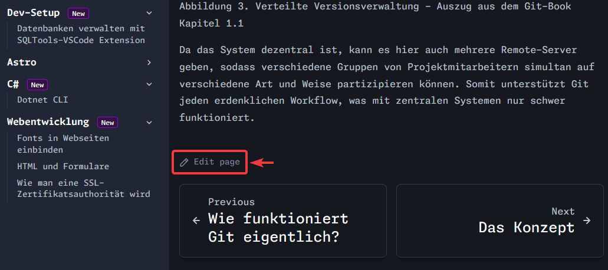
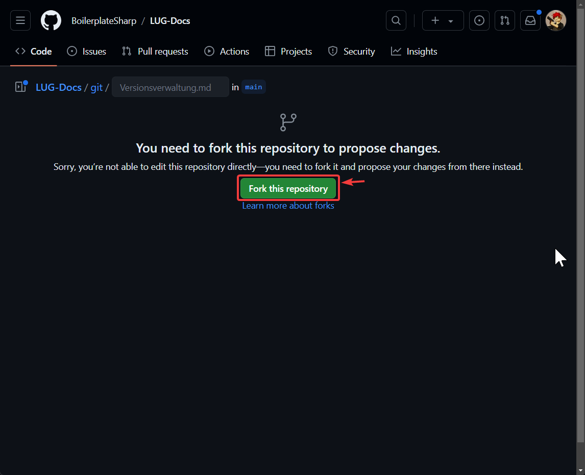

Du hast dich dafür entschieden bei diesem Projekt mitzuhelfen! Danke dafür! 💪

:::note

Falls du es noch nicht getan hast, solltest du unserem [Discord Server](https://discord.gg/NzHk4m7d5w) beitreten. Dort kannst du Fragen zu den hier dargestellten Themen beantwortet bekommen, Themen- oder Verbesserungsvorschläge einbringen oder dich mit gleichgesinnten austauschen.

:::

## Die Vision

Das Ziel dieses Projekts ist es, ein Dokumentationssystem zu schaffen, das:

- **Einfach und Verständlich** für alle ist.
- Jedem **unmittelbar** und direkt **zugänglich** ist.
- **Sinnvolle Standards** durchsetzt.
- Ohne großen Aufwand **erweiterbar** ist.

Das *Ziel ist nicht, die perfekten Unterlagen zum Lernen anzubieten*. Vielmehr sollen mit diesem System Unterlagen in einem iterativen Prozess erstellt werden. Etwas haben ist meist besser, als nichts zu haben. Durch die **offene Natur** dieses Projekts, und den **verschiedenen Mitwirkungsmöglichkeiten**, sollen mithilfe der **Community** diese Dokumente konstant verbessert werden.

## Projektübersicht

Das Projekt besteht aus 2 Teilen:

[LUG-Learn](https://github.com/boilerplatesharp/lug-learn)

[LUG-Docs](https://github.com/boilerplatesharp/lug-docs)

LUG-Learn ist die Webseite, auf der du dich gerade befindest. Es ist eine AstroJS Seite, welche das Starlight Dokumentations-Theme verwendet. AstroJS ist ein JavaScript-Framework für Webseiten, welche auf Content, als Inhalte, fokusiert ist. 

## Über die Docs

Die Dokumentation besteht lediglich aus Markdown- und MDX-Dateien, welche in einem `/docs` Ordner gespeichert sind.

In `/docs` existiert für jedes übergeordnete Thema ein Ordner, in dem die entsprechenden Dokumente abgelegt werden. Solange ein **Dokument in Erstellung** ist und noch nicht für die Veröffentlichung bereit ist, muss dieses in `/drafts` abgelegt werden. Ein Dokument welches sich im Review-Prozess befindet, kann für eine bessere Übersicht im `/review` Ordner abgelegt werden.

## Möglichkeiten mitzuhelfen

### Vorschläge diskutieren

Unter dem **Discord Channel `Themenvorschläge`** kannst du Vorschläge für neue Themenbereiche, einzelne Unterthemen oder kurzen Help-Artikeln einreichen und die der anderen Diskutieren.

Wenn der Vorschlag gut in unser Konzept passt und sich ein **Contributor** findet, welcher sich in dem Thema entsprechend auskennt oder sich dem Thema annehmen möchte, wird ein entsprechendes **Issue auf Github** erstellt. Darunter finden dann alle weiteren Diskussionen bezüglich des Themas statt.

### Fehler melden

Alle Dokumente auf dieser Seite befinden sich in einem öffentlichen Github Repository. Dort kann jeder mit einem Github Account ein **Issue** aufmachen. Ein Issue ist wie ein Ticket, wie es im Tech-Support oft funktioniert. Es ist eine Problembeschreibung (oder Feature-Request), das aber jeder auf dem Repository einsehen kann. Die Idee, Ursprünglich aus der Open-Source Software Entwicklung, ist, dass sich so jeder an der Entwicklung, ohne große Mühen, beteiligen kann.

todo: guide issue erstellen

todo: discord bot github issue

### Fehler beheben

Du hast bei Lesen eines Dokuments einen Fehler gefunden und 5 Minuten Zeit? Klicke dafür einfach auf den `Edit page` Link am Ende eines jeden Dokuments auf der Seite.

Falls es das erste Mal ist, dass du eine Verbesserung vornimmst, wirst du auf folgende Seite weitergeleitet:

Dort musst du auf den grünen Fork-Button klicken, worauf dir Github eine eigene Kopie des Repos erstellt unter `<username>/LUG-Docs`. Dort kannst du die Seite einfach bearbeiten und die Änderungen speichern.

Um die Änderungen dann im originalen Repository zu übernehmen, musst du einen Pull-Request einreichen:

todo: how-to fork-commit-pullrequest

#### Für Git-User

**Du bist Maintainer** im Docs-Repository?
Dann klone einfach das [Github Repository für die Docs](https://github.com/BoilerplateSharp/LUG-Docs) und **öffnet es mit Obsidian** oder einem anderen Editor für Markdown-Dateien.

**Du bist kein Maintainer**, möchtest aber trotzdem eine lokale Version auf deinem PC haben und mit einem Editor deiner Wahl mitarbeiten? Dann musst du auf Github einen Fork des Repositories erstellen. Falls Forks für dich Neuland sind, findest du [hier](https://docs.github.com/de/pull-requests/collaborating-with-pull-requests/working-with-forks/fork-a-repo) nähere Informationen und eine kleine Übung dazu.
Nachdem du deine Fork des Projekts erstellt hast, klone dieses Repository auf deinen PC und öffne den Ordner mit einem Markdown-Editor deiner Wahl.

[Obsidian.md](https://obsidian.md) ist ein Markdown-Editor, welcher eine Vielzahl von Plugins und Themes anbietet. Außerdem erleichtert er mit eingebauter Vorschau des Dokuments, wie es im Browser aussehen wird, eine einfache und nahtlose Writing-Experience. 

In dem Repository befindet sich ein `.obsidian` Ordner. Diesen Ordner musst du nicht direkt bearbeiten, er enthält aber eine Konfiguration mit sinnvollen Defaults. Du kannst über das ⚙️Settings-UI alle Einstellungen anpassen, wie es für dich am Besten passt.